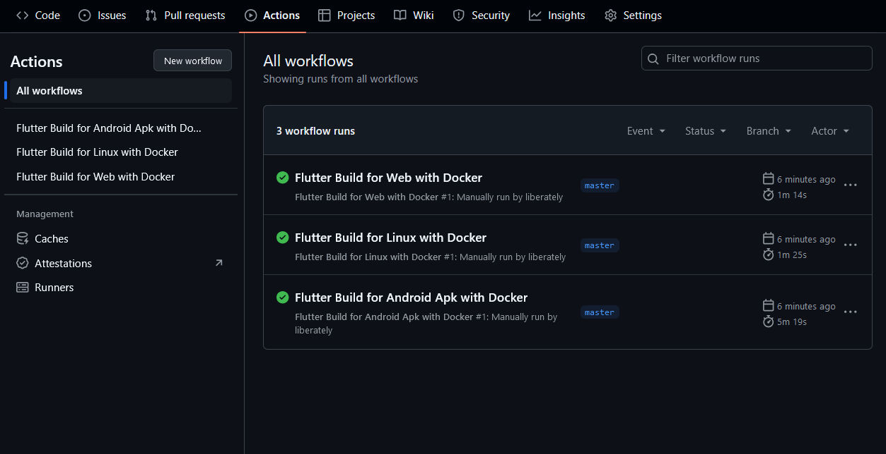

# Docker-Flutter-Builder-Example-App

Docker-Flutter-Builder-Example-App 是一个使用 [Docker-Flutter-Builder](https://github.com/liberately/Docker-Flutter-Builder) 的示例应用，展示了如何在 Github Action 环境中 使用 Docker 自动化构建 Flutter
项目。 该示例涵盖了 Android、iOS、Web 和桌面平台的构建过程，旨在帮助开发者理解如何在不同平台上高效开发和部署 Flutter 应用。

# 功能

- 跨平台支持：演示如何为 Android、iOS、Web 和桌面平台构建 Flutter 应用。
- 自动化构建：通过 Docker 实现构建过程的自动化，减少手动配置和环境问题。
- 示例代码：提供完整的 Flutter 应用代码作为参考。

# 使用

[GitHub Actions documentation](https://docs.github.com/en/actions)

